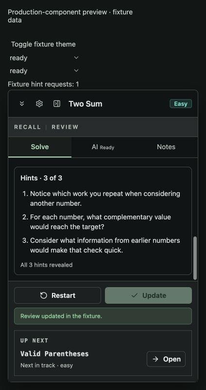
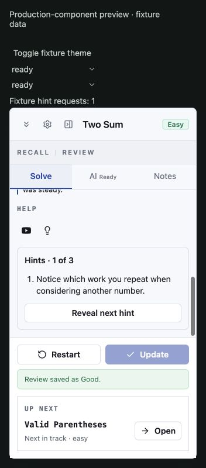

# Progressive Overlay Hints Handoff — 2026-10-05

Branch: `codex/overlay-tabs-design`. Initial locally validated source:
`c69c00709d0aef78eadb606896b0a0cccd8d17df`.

Latest PR-preparation source: `5eb6b30c587f43613a0ff1e9a80b47fa2da9a4fd`;
see the updated validation record below.

Source implementation, independent SPEC/QUALITY reviews of source Tasks 1–9,
automated checks, and production-component fixture evidence are complete.
**HUMAN INSTALLED-EXTENSION SMOKE PENDING** and **LIVE PROVIDER QUALITY
EVALUATION PENDING**. This behavior-changing feature is **NOT PR REVIEW OR
MERGE READY** until those gates have proof. Neither gate is N/A, and neither
unit tests nor fixture screenshots complete them. The initial local closeout
performed no push, PR, merge, or release. The user subsequently requested a PR;
the preparation below keeps it draft until the outstanding gates are satisfied.

## PR Preparation And Local Closeout — 2026-10-05

| Revision / stage                                                               | Review, corrections, and remaining gates                                                                                                                                                                                                                                                                                                             |
| ------------------------------------------------------------------------------ | ---------------------------------------------------------------------------------------------------------------------------------------------------------------------------------------------------------------------------------------------------------------------------------------------------------------------------------------------------- |
| `98d3633f` integration; conflict resolved `d022347`                            | Inherited OpenRouter, dependency scanning and explicit provider activation; only planning-index conflict, retaining both entry sets.                                                                                                                                                                                                                 |
| Latest validated preparation source `5eb6b30c587f43613a0ff1e9a80b47fa2da9a4fd` | Integration review found missing inline Settings recovery for inherited `billing`; two-line controller/test fix passed fresh SPEC then QUALITY. Scope/persistence/permissions/automatic assessment unchanged relative to main; no additional provider calls or application-key reads.                                                                |
| Task 10 docs `67b56b0e2978e5897b3f34740ba54b4581a30627`                        | Fresh SPEC then QUALITY passed.                                                                                                                                                                                                                                                                                                                      |
| Final review `d829a705..40a994d2e8eecdcbf3f02e8302d1c570ff0fff28`              | Whole implementation/execution record approved without actionable findings. Reviewer did not repeat `rtk proxy npm run lint`, `rtk proxy npm run check`, or `rtk proxy npm run build`: root same-source results passed; no focused concern justified duplication.                                                                                    |
| Historical closeout                                                            | No push/PR/merge/release; preserved branch/worktree. Original `rtk proxy npm ci` preflight was unrecorded and remained unchecked; no closeout reinstall. Later PR locked install below does not retroactively prove that preflight.                                                                                                                  |
| PR preparation                                                                 | User subsequently requested draft PR. Human installed-extension smoke/proof and live-provider quality remain pending; packaging/Store/database-generation skips below remain. No review/merge readiness/release claimed. Exact 56-file source formatting command in Final Automated Validation was repeated on latest preparation source and passed. |

Two existing fixture images were copied for GitHub-visible draft PR proof:





<!-- prettier-ignore -->
| Dated stage (2026-10-05) | Exact command / ledger reference | Outcome |
| --- | --- | --- |
| PR integration | `rtk git fetch origin main` | Fetch passed. |
| PR integration | `rtk proxy git merge-tree --write-tree HEAD origin/main` | Sandboxed temporary-object write failed; authorized retry and merge found planning-index conflict. |
| PR integration | `rtk git merge origin/main --no-commit` | Index conflict resolved retaining both entry sets in `d022347`. |
| PR integration | `rtk proxy zsh -c 'source /Users/tobiolutimehin/.nvm/nvm.sh && nvm use 24.20.0 && rtk proxy npx prettier --ignore-path /dev/null --write docs/superpowers/README.md && rtk proxy npx prettier --ignore-path /dev/null --check docs/superpowers/README.md'` | Index scoped write/check passed. |
| PR integration | `rtk proxy zsh -c 'source /Users/tobiolutimehin/.nvm/nvm.sh && nvm use 24.20.0 && rtk proxy npm ci'` | Locked install passed: 481 packages; existing audit/install-script warnings. Distinct from unrecorded original preflight. |
| PR integration | `rtk proxy zsh -c 'source /Users/tobiolutimehin/.nvm/nvm.sh && nvm use 24.20.0 && rtk proxy npm run check'` | Initial TS2307 missing inherited OpenRouter SDK; after install 3,027 tests passed; billing fix 216 files / 3,028 tests; two files / nine live cases skipped. |
| PR integration | `rtk proxy zsh -c 'source /Users/tobiolutimehin/.nvm/nvm.sh && nvm use 24.20.0 && rtk proxy npm run build'` | Both builds passed; latest Chrome MV3 4.82 MB; existing chunk/scrollTo warnings. |
| Billing recovery | `rtk npm test -- src/features/overlay-session/hooks/use-leetcode-code-hints.test.tsx -t 'offers Settings recovery for billing'` | Expected RED (`showSettings` false); production addition then GREEN. |
| Billing recovery | `rtk npm test -- src/features/overlay-session/hooks/use-leetcode-code-hints.test.tsx` | All 35 controller tests passed. |
| Billing recovery | `rtk npm exec prettier -- --check src/features/overlay-session/hooks/use-leetcode-code-hints.ts src/features/overlay-session/hooks/use-leetcode-code-hints.test.tsx` | Scoped format passed. |
| Billing recovery | `rtk npm exec eslint -- src/features/overlay-session/hooks/use-leetcode-code-hints.ts src/features/overlay-session/hooks/use-leetcode-code-hints.test.tsx` | Scoped lint passed. |
| Billing recovery | [L06](#appendix-exact-recorded-command-ledger) | Passed. |
| Fresh SPEC | `rtk proxy zsh -c 'source /Users/tobiolutimehin/.nvm/nvm.sh && nvm use 24.20.0 && rtk npm run test -- src/features/overlay-session/hooks/use-leetcode-code-hints.test.tsx --maxWorkers=1'` | SPEC independently passed 35 tests; QUALITY approved two-file delta. |
| PR evidence docs | `rtk proxy zsh -c 'source /Users/tobiolutimehin/.nvm/nvm.sh && nvm use 24.20.0 && rtk proxy npx prettier --ignore-path /dev/null --write docs/superpowers/handoffs/2026-10-04-overlay-ai-hints.md && rtk proxy npx prettier --ignore-path /dev/null --check docs/superpowers/handoffs/2026-10-04-overlay-ai-hints.md'` | Passed; documentation only after validated source. |
| PR evidence docs | [L06](#appendix-exact-recorded-command-ledger) | Passed; documentation only after validated source. |
| PR evidence docs | [L07](#appendix-exact-recorded-command-ledger) | Passed; documentation only after validated source. |
| Final review | `rtk proxy zsh -c 'source /Users/tobiolutimehin/.nvm/nvm.sh && nvm use 24.20.0 && rtk proxy npx vitest run src/features/overlay-session/hooks/use-leetcode-code-hints.test.tsx src/features/overlay-session/hooks/use-leetcode-overlay-session.test.tsx src/features/overlay-session/components/modes/expanded/overlay-tabs.test.tsx src/features/overlay-session/components/modes/expanded/expanded-overlay.test.tsx src/features/genai/server/genai-settings-service.test.ts src/features/leetcode-review-assistant/server/hint-runtime-service.test.ts src/features/leetcode-capture/api/prepare-code-hint-context.test.ts src/extension/background/leetcode-analysis-operations.test.ts src/extension/background/runtime-policy.test.ts src/extension/background/register-handlers.test.ts src/app/providers/cache-invalidation-listener.test.tsx src/platform/query/cache-invalidation.test.ts'` | 12 suites / 369 tests passed on Node 24.20.0/npm 11.19.0. |
| Final review | `rtk proxy git diff --check d829a705 40a994d2e8eecdcbf3f02e8302d1c570ff0fff28` | Passed. |
| Final review | `rtk proxy git status --short` | Clean. |
| Final review | `rtk proxy git rev-parse HEAD` | Matched reviewed revision. |
| Execution-status docs | `rtk proxy zsh -c 'source /Users/tobiolutimehin/.nvm/nvm.sh && nvm use 24.20.0 && rtk proxy npx prettier --ignore-path /dev/null --write docs/superpowers/README.md docs/superpowers/plans/2026-10-04-overlay-focused-tabs.md docs/superpowers/plans/2026-10-04-overlay-ai-hints.md docs/superpowers/specs/2026-10-04-tabbed-overlay-and-ai-hints-design.md && rtk proxy npx prettier --ignore-path /dev/null --check docs/superpowers/README.md docs/superpowers/plans/2026-10-04-overlay-focused-tabs.md docs/superpowers/plans/2026-10-04-overlay-ai-hints.md docs/superpowers/specs/2026-10-04-tabbed-overlay-and-ai-hints-design.md'` | Scoped formatting/whitespace passed. |
| Execution-status docs | [L06](#appendix-exact-recorded-command-ledger) | Scoped formatting/whitespace passed. |
| Execution-status docs | [L07](#appendix-exact-recorded-command-ledger) | Scoped formatting/whitespace passed. |
| Execution-status docs | `rtk git diff --check d829a705 HEAD` | Scoped formatting/whitespace passed. |
| Closing evidence docs | `rtk proxy zsh -c 'source /Users/tobiolutimehin/.nvm/nvm.sh && nvm use 24.20.0 && rtk proxy npx prettier --ignore-path /dev/null --write docs/superpowers/handoffs/2026-10-04-overlay-ai-hints.md docs/superpowers/plans/2026-10-04-overlay-focused-tabs.md docs/superpowers/plans/2026-10-04-overlay-ai-hints.md docs/superpowers/specs/2026-10-04-tabbed-overlay-and-ai-hints-design.md && rtk proxy npx prettier --ignore-path /dev/null --check docs/superpowers/handoffs/2026-10-04-overlay-ai-hints.md docs/superpowers/plans/2026-10-04-overlay-focused-tabs.md docs/superpowers/plans/2026-10-04-overlay-ai-hints.md docs/superpowers/specs/2026-10-04-tabbed-overlay-and-ai-hints-design.md'` | Scoped formatting/whitespace passed. |
| Closing evidence docs | [L06](#appendix-exact-recorded-command-ledger) | Scoped formatting/whitespace passed. |
| Closing evidence docs | [L07](#appendix-exact-recorded-command-ledger) | Scoped formatting/whitespace passed. |

## Result And Scope

Solve's compact Help row now offers YouTube and an explicit AI hints action.
One request uses the selected saved provider/model/key, even with automatic AI
assessment off, and returns one to three short progressively stronger pointers.
The first appears when ready; Reveal next exposes the retained batch locally.
Busy and controlled error states offer explicit Retry/Settings where useful.
Folding/reopening, tabs, collapsed/expanded/docked modes, accepted/failed saves,
rating updates, and ordinary metadata refetches preserve the batch, reveal count,
and disclosure without another generation. Restart, navigation, reload/remount,
selected-input changes, saved connection changes/removal, and full local-data
clear/reset invalidate it. Assessment enable-only changes preserve hints.

`overlay-session` owns transient hint state and operation lifetime above modes.
`leetcode-capture` selects complete matching host/slug, canonical title,
statement, example raw text, and constraints before submission. Selected JSON
identity excludes editor/submission code, diagnostics, topics, official hints,
follow-ups, and authentication. Strict contracts reject incomplete/mismatched
input, JSON above 24,000 characters, more than 50 examples, or more than 100
constraints without repair/truncation. Review Assistant owns problem-only
contracts/prompt/service: one to three distinct trimmed nonblank pointers, each
at most 200 characters; conceptual prompt quality needs real-provider review.

GenAI returns only `{ available, provider, revision }`, using an opaque UUID.
Private key-bearing identity stays in background memory. Selected
provider/model/key changes rotate it; unselected keys and assessment enable-only
changes do not. Read ordering and a captured registry reset epoch prevent late
configuration observations from poisoning current metadata. The existing app
cache listener clears public hint metadata before a full-replacement refetch;
failed/hung rereads cannot retain ready hints. Ordinary invalidations retain
cached public metadata while fetching. Queries hold only public metadata;
pointers and operations stay outside query/mutation caches and persistence.

The runtime binds strict Zod requests to the sender's actual supported HTTPS
LeetCode host/slug. Hint and automatic-report tab/frame/request operation maps
and owning cancellation are separate, including cancellation after SPA
navigation. Automatic reports keep their existing disable/cancellation rules.
Hint preparation is bounded at 15 seconds, the entire background operation
(startup/database/config/key/generation/final connection check) at 30 seconds,
and the complete client operation at 50 seconds. There is at most one provider
attempt with `maxOutputTokens: 1024`. Public connection metadata is bounded at
20 seconds in the background and 25 seconds in the client. Explicit Retry uses
a fresh UUID; stale/not-configured recovery refreshes metadata within the same
client deadline. Missing configuration offers Settings without auto-generation.

Hints never change reviews, logs, rating, correctness, solve time, FSRS,
Analytics, backup, or sync. Notes remains reserved without editing/persistence.
No database schema/migration, permission, provider host, authentication,
backend, sync format, or persisted log format changed.

## Final Automated Validation

The root agent independently ran these commands on the source SHA above with
Node 24.20.0 and npm 11.19.0. These are initial-closeout source results; latest preparation and approved-cut outcomes are recorded separately. Historical task
counts below describe the source at each task, not the final suite count.

```sh
rtk proxy zsh -c 'source /Users/tobiolutimehin/.nvm/nvm.sh && nvm use 24.20.0 && rtk proxy npm run lint'
```

Passed.

```sh
rtk proxy zsh -c 'source /Users/tobiolutimehin/.nvm/nvm.sh && nvm use 24.20.0 && rtk proxy npm run check'
```

Passed database checks, WXT preparation, TypeScript, ESLint, and Vitest:
216 files passed, 2 files skipped; 2,904 tests passed, 9 live tests skipped
(six existing analysis cases and three hint evaluation cases). Existing JSDOM
`Window.scrollTo` warnings remain.

```sh
rtk proxy zsh -c 'source /Users/tobiolutimehin/.nvm/nvm.sh && nvm use 24.20.0 && rtk proxy npm run build'
```

Passed Chrome MV3 production build into `dist/chrome-mv3`, 4.73 MB. Vite
reported its chunks-larger-than-500-kB warning; the build succeeded.

```sh
rtk proxy zsh -c 'source /Users/tobiolutimehin/.nvm/nvm.sh && nvm use 24.20.0 && rtk proxy npx prettier --ignore-path /dev/null --check '\''src/app/providers/cache-invalidation-listener.test.tsx'\'' '\''src/app/providers/cache-invalidation-listener.tsx'\'' '\''src/extension/background/cache-invalidation-broadcaster.test.ts'\'' '\''src/extension/background/cache-invalidation-broadcaster.ts'\'' '\''src/extension/background/leetcode-analysis-operations.test.ts'\'' '\''src/extension/background/leetcode-analysis-operations.ts'\'' '\''src/extension/background/register-handlers.test.ts'\'' '\''src/extension/background/register-handlers.ts'\'' '\''src/extension/background/runtime-policy.test.ts'\'' '\''src/extension/background/runtime-policy.ts'\'' '\''src/extension/messaging.ts'\'' '\''src/features/genai/api/hint-connection-contracts.ts'\'' '\''src/features/genai/api/hint-connection-hooks.ts'\'' '\''src/features/genai/index.ts'\'' '\''src/features/genai/server/genai-settings-service.test.ts'\'' '\''src/features/genai/server/genai-settings-service.ts'\'' '\''src/features/leetcode-capture/api/prepare-code-hint-context.test.ts'\'' '\''src/features/leetcode-capture/api/prepare-code-hint-context.ts'\'' '\''src/features/leetcode-capture/index.ts'\'' '\''src/features/leetcode-capture/server/leetcode-capture-service.cache.test.ts'\'' '\''src/features/leetcode-capture/server/leetcode-capture-service.ts'\'' '\''src/features/leetcode-review-assistant/api/code-hint-api.test.ts'\'' '\''src/features/leetcode-review-assistant/api/code-hint-api.ts'\'' '\''src/features/leetcode-review-assistant/api/code-hint-contracts.test.ts'\'' '\''src/features/leetcode-review-assistant/api/code-hint-contracts.ts'\'' '\''src/features/leetcode-review-assistant/domain/code-hint-schema.ts'\'' '\''src/features/leetcode-review-assistant/index.ts'\'' '\''src/features/leetcode-review-assistant/server/code-hint-provider-evaluation.test.ts'\'' '\''src/features/leetcode-review-assistant/server/code-hint-service.test.ts'\'' '\''src/features/leetcode-review-assistant/server/code-hint-service.ts'\'' '\''src/features/leetcode-review-assistant/server/hint-runtime-service.test.ts'\'' '\''src/features/leetcode-review-assistant/server/hint-runtime-service.ts'\'' '\''src/features/leetcode-review-assistant/testing/code-hint-evaluation-fixtures.ts'\'' '\''src/features/overlay-session/components/modes/expanded/expanded-overlay.test.tsx'\'' '\''src/features/overlay-session/components/modes/expanded/expanded-overlay.tsx'\'' '\''src/features/overlay-session/components/modes/expanded/overlay-code-analysis.test.tsx'\'' '\''src/features/overlay-session/components/modes/expanded/overlay-code-analysis.tsx'\'' '\''src/features/overlay-session/components/modes/expanded/overlay-help-section.test.tsx'\'' '\''src/features/overlay-session/components/modes/expanded/overlay-help-section.tsx'\'' '\''src/features/overlay-session/components/modes/expanded/overlay-hint-block.tsx'\'' '\''src/features/overlay-session/components/modes/expanded/overlay-tabs.test.tsx'\'' '\''src/features/overlay-session/components/modes/expanded/overlay-tabs.tsx'\'' '\''src/features/overlay-session/components/overlay-shell.test.tsx'\'' '\''src/features/overlay-session/components/overlay-shell.tsx'\'' '\''src/features/overlay-session/domain/index.ts'\'' '\''src/features/overlay-session/domain/overlay-session-state.test.ts'\'' '\''src/features/overlay-session/domain/overlay-session-state.ts'\'' '\''src/features/overlay-session/hooks/use-leetcode-code-hints.test.tsx'\'' '\''src/features/overlay-session/hooks/use-leetcode-code-hints.ts'\'' '\''src/features/overlay-session/hooks/use-leetcode-overlay-session.test.tsx'\'' '\''src/features/overlay-session/hooks/use-leetcode-overlay-session.ts'\'' '\''src/features/overlay-session/hooks/use-leetcode-page-sync.ts'\'' '\''src/features/overlay-session/hooks/use-overlay-review-actions.ts'\'' '\''src/platform/query/cache-invalidation.test.ts'\'' '\''src/platform/query/cache-invalidation.ts'\'' '\''src/platform/query/query-keys.ts'\'''
```

Passed formatting for all 56 changed source files with the explicit
`--ignore-path /dev/null` override and exact paths in the command.

## Focused Validation And Corrections

The command appendix retains every distinct recorded command and all task/fix/
review outcomes, including historical RED, failures, and deferrals. Task
implementer RED reports are historical evidence supplied to the root; they are
not claims that the root independently observed each RED. Root final checks
above and the separately recorded SPEC/QUALITY review runs are distinguished.

| Source stage                          | Focused result and resolved checks                                                                                                                                                                                                                                                                                                                                                                                                                                                                                                     |
| ------------------------------------- | -------------------------------------------------------------------------------------------------------------------------------------------------------------------------------------------------------------------------------------------------------------------------------------------------------------------------------------------------------------------------------------------------------------------------------------------------------------------------------------------------------------------------------------- |
| Phase 1 tabs                          | Six focused files / 85 tests passed; full check had 210 passed files / 2,711 passed tests and one skipped file / six existing live cases. Lint and Chrome MV3 build passed, with existing scrollTo/chunk warnings.                                                                                                                                                                                                                                                                                                                     |
| Task 1 contracts                      | Reported missing-module RED, then 32 contract tests passed, including after the pure-import correction `e19fdd4`. Typecheck, scoped ESLint, and formatting passed.                                                                                                                                                                                                                                                                                                                                                                     |
| Task 2 capture                        | Missing preparation module RED; initial mock-export failure was corrected before the intended cache regression (expected 2, got 1). Final 48 tests passed (25 preparation, 23 cache). Two require-await mock lint errors were corrected.                                                                                                                                                                                                                                                                                               |
| Task 3 connection metadata            | Nine new missing-function failures with 17 existing passes, then 26 tests passed. Review found late async reads could overwrite newer revisions/repopulate reset state; `061ec59d` added issued/committed ordering and reset epoch. Two regression failures with 26 passes became 28 passes; combined query/connection suite passed 38. Two unsafe matcher assignments and one callback dependency warning were fixed. Typecheck was deferred at this source stage to Task 6 protocol registration, then covered by later full checks. |
| Task 4 service                        | Missing-module RED; initial service test passed, then 22 service/runtime tests passed twice. Quality review also passed 71 tests across service/runtime and AI transport/deadline files.                                                                                                                                                                                                                                                                                                                                               |
| Tasks 5–6 runtime                     | Missing-operation RED became 22 passes. An intermediate 99 passes / one expected inventory mismatch was resolved by protocol registration. The initial six-file focused suite passed 224 tests. Three operation-test lint callback errors were fixed; full check passed 215 files / 2,845 tests with one file / six existing live cases skipped.                                                                                                                                                                                       |
| Tasks 5–6 full replacement correction | Review found ready hints could survive failed metadata rereads after full replacement. `83b5b52a` reset only the public query using the existing wire signature before refetch; three expected reset regression failures became part of a 245-test / eight-file pass. Full check then passed 215 suites / 2,855 tests, with one suite / six existing live cases skipped. SPEC/QUALITY approved this correction.                                                                                                                        |
| Task 7 controller                     | Missing-module RED became 31 passes; a self-review refresh-marker regression (30 passes / one failure) returned to 31 passes. SPEC correction `aacb68e` added unavailable Retry recovery (30 passes / four failures became 34 passes). Quality suites passed 137 and 68 tests. Initial 36 test ESLint errors and three possibly-undefined destructuring errors were fixed; full check passed 216 suites / 2,886 tests with one suite / six live cases skipped.                                                                         |
| Task 8 Help integration               | Missing-integration RED had 12 expected failures / 36 existing passes. Initial GREEN had 218 passes and two observer-notification timing failures; corrected final suite passed 220 tests / 15 suites. Optional callback forwarding typecheck failure and two async mock lint errors were fixed. Full check passed 216 files / 2,904 tests with one file / six existing live cases skipped.                                                                                                                                            |
| Task 9 evaluation harness             | Implementer reported Vitest import-analysis could not resolve `../testing/code-hint-evaluation-fixtures`: exit 1, zero tests. After adding the fixture, all three live cases skipped without provider calls or artifacts. The corrected exact composite formatter/linter/typecheck command is in the appendix.                                                                                                                                                                                                                         |

## Production-Component Fixture Evidence

Browser evidence used source `87dcaeda5621a924255259920c36f4ed33cb8d00`, the real
production hint controller, Expanded/Help/Collapsed/Docked components, public
capture and saved-connection metadata fixtures, and fixture-only runtime
`sendMessage`. This was **a production-component fixture, not an installed
extension or live provider**. There were no external runtime/provider calls.
Timer, assessment context, review persistence, and Settings navigation were
simulated; actual session/query/runtime boundaries have separate unit coverage.
The temporary fixture mirrors WXT's entry-CSS `:root` to `:host` remapping and
registers `@property` at document scope for WebKit so preview tokens, stacking,
and radii apply. This is fixture setup, not a production-source change or proof
of the installed content-script styling.

Recorded flows covered idle with no card/request; explicit busy-to-first-pointer
with one fixture call; local second/third reveal and final actual count; retained
disclosure/count across Help and Solve/AI/Notes; collapse/reopen and dock then
restore to collapsed then explicitly expand; simulated review updates without
extra calls; controlled auth error/explicit Retry; narrow wrapping; short-height
50-second timeout; pending simulated update; and Restart clearing without
generation. No browser console warnings/errors were recorded and viewport
overrides were reset. Fixture proof does not establish realtime review/timer
persistence, installed-runtime lifecycle, or provider quality.
The eight linked captures were refreshed with the fixture CSS remapping above.
Repeated reveal/tab/mode/simulated-update flows retained fixture request count 1;
hint content measured `clientWidth === scrollWidth` at 292px in the 320px preview
and 364px in the 392px preview. The actual 50-second client deadline was exercised.

- [First pointer, light, 320px — production-component fixture](/Users/tobiolutimehin/.codex/visualizations/2026/10/05/01a109eb-84ec-7973-8911-b8ff68aa56fd/overlay-hints-first-light-320.jpg)
- [Progressive reveal, light, 320px — production-component fixture](/Users/tobiolutimehin/.codex/visualizations/2026/10/05/01a109eb-84ec-7973-8911-b8ff68aa56fd/overlay-hints-progressive-light-320.jpg)
- [Final actual batch, dark, 392px — production-component fixture](/Users/tobiolutimehin/.codex/visualizations/2026/10/05/01a109eb-84ec-7973-8911-b8ff68aa56fd/overlay-hints-final-dark-392.jpg)
- [Controlled error, dark, 320px — production-component fixture](/Users/tobiolutimehin/.codex/visualizations/2026/10/05/01a109eb-84ec-7973-8911-b8ff68aa56fd/overlay-hints-error-dark-320.jpg)
- [Retained after simulated update, light, 320px — production-component fixture](/Users/tobiolutimehin/.codex/visualizations/2026/10/05/01a109eb-84ec-7973-8911-b8ff68aa56fd/overlay-hints-retained-update-light-320.jpg)
- [Pending simulated save/update, dark, short viewport — production-component fixture](/Users/tobiolutimehin/.codex/visualizations/2026/10/05/01a109eb-84ec-7973-8911-b8ff68aa56fd/overlay-hints-pending-save-dark-short.jpg)
- [50-second timeout, dark, short viewport — production-component fixture](/Users/tobiolutimehin/.codex/visualizations/2026/10/05/01a109eb-84ec-7973-8911-b8ff68aa56fd/overlay-hints-timeout-dark-short.jpg)
- [Restart, dark, short viewport — production-component fixture](/Users/tobiolutimehin/.codex/visualizations/2026/10/05/01a109eb-84ec-7973-8911-b8ff68aa56fd/overlay-hints-restart-dark-short.jpg)

## Pending Gates And Skipped Commands

Human installed-extension happy-path and edge-case smoke with screenshot or
recording proof is pending. Run and attach the exact
[manual hints checklist](../../testing.md#required-human-installed-extension-manual-hints-smoke)
and the existing focused-tab/automatic-analysis flows. Record the installed
extension version and ready/progressive/final, busy, error, retained-after-save,
and restart/navigation proof. Fixture screenshots do not satisfy this gate.

Live provider quality is pending: privately configure the test environment,
then inspect all three real batches for provider/model/date/latency,
progression, usefulness, length, duplicates, and spoiler restraint using
[the evaluation checklist](../../testing.md#manual-hints-provider-evaluation).
Presence-only evidence on 2026-10-05 found opt-in false and private
provider/model/key fields absent; no values were printed, app-stored keys were
not read, and no live provider request was run.

| Exact skipped command or manual flow                                                                                                      | Reason                                                                                                                                                                  |
| ----------------------------------------------------------------------------------------------------------------------------------------- | ----------------------------------------------------------------------------------------------------------------------------------------------------------------------- |
| `rtk proxy env COGNIPACE_AI_EVAL=1 npm test -- src/features/leetcode-review-assistant/server/code-hint-provider-evaluation.test.ts --run` | Private evaluation configuration absent; live provider quality remains pending. Ordinary checks intentionally skipped three hint cases and six existing analysis cases. |
| Human installed-extension happy-path and edge-case checklist linked above                                                                 | Not performed by the human engineer; realtime smoke and screenshot/recording proof remain pending, not N/A. This manual flow has no shell command.                      |
| `rtk proxy npm run db:generate`                                                                                                           | No schema or migration change. Database checking did run inside the successful full check.                                                                              |
| `rtk proxy npm run zip`                                                                                                                   | No packaging request or artifact behavior change. Production build did run and passed.                                                                                  |
| `rtk proxy npm run store:check`                                                                                                           | No Chrome Web Store submission or release request.                                                                                                                      |
| `rtk proxy npx prettier --write .`                                                                                                        | Full-repository formatter write avoided unrelated files; exact 56-file changed-source checking and scoped five-document formatting cover this work instead.             |

## Release, Recovery, And Remaining Risk

Release impact is a feature addition: manual progressive hints alongside the
focused overlay tabs. This documentation commit is maintenance; a future PR
title must describe the feature's actual release impact. No push, PR, merge,
packaging, Store submission, or release was authorized as part of this handoff.
Refresh installed LeetCode content scripts for the newly built extension version
when running human smoke.

Recovery is to remove the Help AI action or remove its saved connection, leaving
the review workflow usable. Turning automatic assessment off alone does not
disable manual hints. No database reset or migration rollback is needed.
Remaining risks are real-provider usefulness/progression/spoiler restraint and
realtime installed-extension capture, timer/review persistence, cancellation,
connection invalidation, and short-viewport/ShadowRoot behavior until the pending
gates have evidence.

## Documentation Validation

The docs implementer ran these exact five-file commands with Node 24.20.0 and
npm 11.19.0; scoped formatting write and check both passed:

```sh
rtk proxy zsh -c 'source /Users/tobiolutimehin/.nvm/nvm.sh && nvm use 24.20.0 && rtk proxy npx prettier --ignore-path /dev/null --write docs/product.md docs/architecture.md docs/testing.md design.md docs/superpowers/handoffs/2026-10-04-overlay-ai-hints.md'
```

```sh
rtk proxy zsh -c 'source /Users/tobiolutimehin/.nvm/nvm.sh && nvm use 24.20.0 && rtk proxy npx prettier --ignore-path /dev/null --check docs/product.md docs/architecture.md docs/testing.md design.md docs/superpowers/handoffs/2026-10-04-overlay-ai-hints.md'
```

[L06](#appendix-exact-recorded-command-ledger)
[L07](#appendix-exact-recorded-command-ledger)

Both unstaged and staged diff whitespace checks passed for the five-file scope.
The same scoped formatter and diff checks
were repeated after recording their results here. Full source checks/build above
are fresh and were not repeated for this docs-only change.

## Approved Simplification Validation — 2026-10-05

Eight user-approved cuts remove duplicated wire fingerprint/slug and replace the five-field response echo check with `requestId` correlation, share the private ownership runner/cancellation, remove remaining-budget timeout threading, and remove restart-reset refs/effects. The remaining four cuts compress both task maps and historical handoff prose. Local selected-input identity and guards, strict problem parsing, sender binding, connection checks and operation cancellation remain. Work started from documentation baseline `dab020f6`; these results describe the uncommitted code-cut revision, not the original closeout source.

Code SPEC review approved all four code cuts (independent five-suite / 124-test then three-suite / 116-test runs). QUALITY review found no actionable issue after four suites / 113 tests. Implementer RED/GREEN and focused/full results are recorded below. Root repeated the exact lint/build wrappers in [Final Automated Validation](#final-automated-validation): both passed; Chrome MV3 output was 4.82 MB with the existing large-chunk warning. Root changed-source formatting passed. `rtk git diff --check` ([L06](#appendix-exact-recorded-command-ledger)) passed three times. No new provider calls or human installed-extension proof occurred.

<!-- prettier-ignore -->
| Exact command | Current cut outcome |
| --- | --- |
| `rtk proxy env PATH=/Users/tobiolutimehin/.nvm/versions/node/v24.20.0/bin:/opt/homebrew/bin:/usr/bin:/bin:/usr/sbin:/sbin npm test -- src/features/leetcode-review-assistant/api/code-hint-contracts.test.ts --run` | RED 3 failed/29 passed, then GREEN32passed. |
| `rtk proxy env PATH=/Users/tobiolutimehin/.nvm/versions/node/v24.20.0/bin:/opt/homebrew/bin:/usr/bin:/bin:/usr/sbin:/sbin npm test -- src/features/leetcode-review-assistant/server/code-hint-service.test.ts src/features/leetcode-review-assistant/server/hint-runtime-service.test.ts --run` | RED1failed/21passed, thenGREEN22passed. |
| `rtk proxy env PATH=/Users/tobiolutimehin/.nvm/versions/node/v24.20.0/bin:/opt/homebrew/bin:/usr/bin:/bin:/usr/sbin:/sbin npm test -- src/extension/background/leetcode-analysis-operations.test.ts src/features/overlay-session/hooks/use-leetcode-overlay-session.test.tsx --run` | Baseline2files57passed. |
| `rtk proxy zsh -c 'source /Users/tobiolutimehin/.nvm/nvm.sh && nvm use 24.20.0 && rtk proxy npx prettier --check '\''src/extension/background/leetcode-analysis-operations.ts'\'' '\''src/extension/background/register-handlers.test.ts'\'' '\''src/features/leetcode-capture/api/prepare-code-hint-context.test.ts'\'' '\''src/features/leetcode-capture/api/prepare-code-hint-context.ts'\'' '\''src/features/leetcode-review-assistant/api/code-hint-api.test.ts'\'' '\''src/features/leetcode-review-assistant/api/code-hint-contracts.test.ts'\'' '\''src/features/leetcode-review-assistant/api/code-hint-contracts.ts'\'' '\''src/features/leetcode-review-assistant/index.ts'\'' '\''src/features/leetcode-review-assistant/server/code-hint-provider-evaluation.test.ts'\'' '\''src/features/leetcode-review-assistant/server/code-hint-service.test.ts'\'' '\''src/features/leetcode-review-assistant/server/code-hint-service.ts'\'' '\''src/features/leetcode-review-assistant/server/hint-runtime-service.test.ts'\'' '\''src/features/leetcode-review-assistant/server/hint-runtime-service.ts'\'' '\''src/features/overlay-session/hooks/use-leetcode-code-hints.test.tsx'\'' '\''src/features/overlay-session/hooks/use-leetcode-code-hints.ts'\'' '\''src/features/overlay-session/hooks/use-leetcode-overlay-session.test.tsx'\'' '\''src/features/overlay-session/hooks/use-leetcode-overlay-session.ts'\'''` | All changedsourceformat passed. |
| `rtk proxy env PATH=/Users/tobiolutimehin/.nvm/versions/node/v24.20.0/bin:/opt/homebrew/bin:/usr/bin:/bin:/usr/sbin:/sbin npm test -- src/features/leetcode-review-assistant/api/code-hint-contracts.test.ts src/features/leetcode-review-assistant/api/code-hint-api.test.ts src/features/leetcode-review-assistant/server/code-hint-service.test.ts src/features/leetcode-review-assistant/server/hint-runtime-service.test.ts src/features/leetcode-capture/api/prepare-code-hint-context.test.ts src/features/overlay-session/hooks/use-leetcode-code-hints.test.tsx src/features/overlay-session/hooks/use-leetcode-overlay-session.test.tsx src/features/genai/server/genai-settings-service.test.ts src/extension/background/leetcode-analysis-operations.test.ts src/extension/background/register-handlers.test.ts src/extension/background/runtime-policy.test.ts src/extension/background/cache-invalidation-broadcaster.test.ts src/platform/query/cache-invalidation.test.ts src/app/providers/cache-invalidation-listener.test.tsx --run` | Implementer ran twice (before/after ownership simplification): 14 files / 397 tests passed. |
| `rtk proxy env PATH=/Users/tobiolutimehin/.nvm/versions/node/v24.20.0/bin:/opt/homebrew/bin:/usr/bin:/bin:/usr/sbin:/sbin npm run check` | Initial discarded factory variant failed TS2379 optional-property check; factory removed, rerun passed 216 files / 3,028 tests; two files / nine live cases skipped. |
| `rtk proxy env PATH=/Users/tobiolutimehin/.nvm/versions/node/v24.20.0/bin:/opt/homebrew/bin:/usr/bin:/bin:/usr/sbin:/sbin npx prettier --write src/features/leetcode-review-assistant/api/code-hint-contracts.ts src/features/leetcode-review-assistant/api/code-hint-contracts.test.ts src/features/leetcode-review-assistant/api/code-hint-api.test.ts src/features/leetcode-review-assistant/server/hint-runtime-service.ts src/features/leetcode-review-assistant/server/hint-runtime-service.test.ts src/features/leetcode-review-assistant/server/code-hint-service.ts src/features/leetcode-review-assistant/server/code-hint-service.test.ts src/features/leetcode-review-assistant/server/code-hint-provider-evaluation.test.ts src/features/leetcode-review-assistant/index.ts src/features/leetcode-capture/api/prepare-code-hint-context.ts src/features/leetcode-capture/api/prepare-code-hint-context.test.ts src/features/overlay-session/hooks/use-leetcode-code-hints.ts src/features/overlay-session/hooks/use-leetcode-code-hints.test.tsx src/features/overlay-session/hooks/use-leetcode-overlay-session.ts src/features/overlay-session/hooks/use-leetcode-overlay-session.test.tsx src/extension/background/leetcode-analysis-operations.ts src/extension/background/leetcode-analysis-operations.test.ts src/extension/background/register-handlers.ts src/extension/background/register-handlers.test.ts src/extension/background/cache-invalidation-broadcaster.ts src/extension/background/cache-invalidation-broadcaster.test.ts` | Implementer scoped formatting passed; second command reported unchanged. |
| `rtk proxy env PATH=/Users/tobiolutimehin/.nvm/versions/node/v24.20.0/bin:/opt/homebrew/bin:/usr/bin:/bin:/usr/sbin:/sbin npx prettier --write src/extension/background/leetcode-analysis-operations.ts src/extension/background/register-handlers.test.ts` | Implementer scoped formatting passed; second command reported unchanged. |

<!-- prettier-ignore -->
| Exact review command | Current cut outcome |
| --- | --- |
| `rtk proxy zsh -c 'source /Users/tobiolutimehin/.nvm/nvm.sh && nvm use 24.20.0 && rtk proxy npx vitest run src/features/leetcode-review-assistant/api/code-hint-contracts.test.ts src/features/leetcode-review-assistant/server/code-hint-service.test.ts src/features/leetcode-review-assistant/server/hint-runtime-service.test.ts src/features/overlay-session/hooks/use-leetcode-code-hints.test.tsx src/features/overlay-session/hooks/use-leetcode-overlay-session.test.tsx'` | Fresh code-cut SPEC: five suites / 124 tests passed. |
| `rtk proxy zsh -c 'source /Users/tobiolutimehin/.nvm/nvm.sh && nvm use 24.20.0 && rtk proxy npx vitest run src/extension/background/leetcode-analysis-operations.test.ts src/extension/background/cache-invalidation-broadcaster.test.ts src/extension/background/register-handlers.test.ts'` | Fresh code-cut SPEC: three suites / 116 tests passed; all four cuts approved. |
| `rtk proxy zsh -c 'source /Users/tobiolutimehin/.nvm/nvm.sh && nvm use 24.20.0 && rtk npm test -- src/extension/background/leetcode-analysis-operations.test.ts src/features/leetcode-review-assistant/server/hint-runtime-service.test.ts src/features/overlay-session/hooks/use-leetcode-code-hints.test.tsx src/features/overlay-session/hooks/use-leetcode-overlay-session.test.tsx --run'` | Fresh code-cut QUALITY: four suites / 113 tests passed; no actionable findings. |

Fresh code-cut reviewers skipped repeating full lint/check/build because the implementer/root had passed those same-source gates.

Scoped documentation Prettier write/check passed on Node 24.20.0 for all five touched Markdown files with this exact command:

```sh
rtk proxy zsh -c 'source /Users/tobiolutimehin/.nvm/nvm.sh && nvm use 24.20.0 && rtk proxy npx prettier --ignore-path /dev/null --write docs/architecture.md docs/superpowers/specs/2026-10-04-tabbed-overlay-and-ai-hints-design.md docs/superpowers/plans/2026-10-04-overlay-ai-hints.md docs/superpowers/plans/2026-10-04-overlay-focused-tabs.md docs/superpowers/handoffs/2026-10-04-overlay-ai-hints.md && rtk proxy npx prettier --ignore-path /dev/null --check docs/architecture.md docs/superpowers/specs/2026-10-04-tabbed-overlay-and-ai-hints-design.md docs/superpowers/plans/2026-10-04-overlay-ai-hints.md docs/superpowers/plans/2026-10-04-overlay-focused-tabs.md docs/superpowers/handoffs/2026-10-04-overlay-ai-hints.md'
```

Human installed-extension happy-path/edge-case smoke with proof and private live-provider quality remain pending; the PR stays draft.

## Appendix: Exact Recorded Command Ledger

Identical historical command strings appear once; each task/fix/review outcome remains. Counts are historical to that stage. Implementer RED reports are attributed evidence. Original Task 9 separate npx/typecheck entries were corrected to the single composite command below and are not asserted as executions. References elsewhere reuse IDs without normalizing shell spelling.

<!-- prettier-ignore -->
| ID | Exact command | Recorded stage outcomes |
| --- | --- | --- |
| L01 | `rtk proxy npm test -- src/features/leetcode-review-assistant/api/code-hint-contracts.test.ts --run` | Task 1: RED: expected missing module, exit 1.<br>Task 1: GREEN: 32 tests passed.<br>Task 1: Post-format: 32 tests passed.<br>Task 1 fix e19fdd4: 32 passed after pure import fix |
| L02 | `rtk proxy npm run typecheck` | Task 1: passed<br>Task 1 fix e19fdd4: passed<br>Task 2: passed<br>Task 3: Deferred at this stage until protocol registration in Task 6; later full checks passed.<br>Task 7 fix aacb68e: passed |
| L03 | `rtk proxy npx prettier --write src/features/leetcode-review-assistant/domain/code-hint-schema.ts src/features/leetcode-review-assistant/api/code-hint-contracts.ts src/features/leetcode-review-assistant/api/code-hint-contracts.test.ts src/features/leetcode-review-assistant/index.ts` | Task 1: passed |
| L04 | `rtk proxy npx prettier --check src/features/leetcode-review-assistant/domain/code-hint-schema.ts src/features/leetcode-review-assistant/api/code-hint-contracts.ts src/features/leetcode-review-assistant/api/code-hint-contracts.test.ts src/features/leetcode-review-assistant/index.ts` | Task 1: passed |
| L05 | `rtk proxy npx eslint src/features/leetcode-review-assistant/domain/code-hint-schema.ts src/features/leetcode-review-assistant/api/code-hint-contracts.ts src/features/leetcode-review-assistant/api/code-hint-contracts.test.ts src/features/leetcode-review-assistant/index.ts` | Task 1: passed |
| L06 | `rtk git diff --check` | Task 1: passed<br>Task 3: passed<br>Task 4: passed<br>Task 7: passed |
| L07 | `rtk git diff --cached --check` | Task 1: passed<br>Task 4: passed |
| L08 | `rtk npm run test -- src/features/leetcode-review-assistant/api/code-hint-contracts.test.ts --maxWorkers=1` | Task 1 spec: 32 passed |
| L09 | `rtk proxy npx eslint src/features/leetcode-review-assistant/api/code-hint-contracts.ts` | Task 1 fix e19fdd4: passed |
| L10 | `rtk proxy npx prettier --check src/features/leetcode-review-assistant/api/code-hint-contracts.ts` | Task 1 fix e19fdd4: passed |
| L11 | `rtk proxy npm test -- src/features/leetcode-capture/api/prepare-code-hint-context.test.ts --run` | Task 2: RED expected missing module |
| L12 | `rtk proxy npm test -- src/features/leetcode-capture/server/leetcode-capture-service.cache.test.ts --run` | Task 2: RED: initial fixture mock-export failure corrected, then intended cache regression expected 2, got 1. |
| L13 | `rtk proxy npm test -- src/features/leetcode-capture/api/prepare-code-hint-context.test.ts src/features/leetcode-capture/server/leetcode-capture-service.cache.test.ts --run` | Task 2: 48 passed (25 preparation,23 cache)<br>Task 2 quality: 48 passed |
| L14 | `rtk proxy npx prettier --write src/features/leetcode-capture/api/prepare-code-hint-context.ts src/features/leetcode-capture/api/prepare-code-hint-context.test.ts src/features/leetcode-capture/index.ts src/features/leetcode-capture/server/leetcode-capture-service.ts src/features/leetcode-capture/server/leetcode-capture-service.cache.test.ts` | Task 2: passed |
| L15 | `rtk proxy npx prettier --check src/features/leetcode-capture/api/prepare-code-hint-context.ts src/features/leetcode-capture/api/prepare-code-hint-context.test.ts src/features/leetcode-capture/index.ts src/features/leetcode-capture/server/leetcode-capture-service.ts src/features/leetcode-capture/server/leetcode-capture-service.cache.test.ts` | Task 2: passed |
| L16 | `rtk proxy npx eslint src/features/leetcode-capture/api/prepare-code-hint-context.ts src/features/leetcode-capture/api/prepare-code-hint-context.test.ts src/features/leetcode-capture/index.ts src/features/leetcode-capture/server/leetcode-capture-service.ts src/features/leetcode-capture/server/leetcode-capture-service.cache.test.ts` | Task 2: Initial two require-await mock errors corrected; final pass. |
| L17 | `rtk proxy zsh -c 'source /Users/tobiolutimehin/.nvm/nvm.sh && nvm use 24.20.0 && rtk npm run test -- src/features/leetcode-capture/api/prepare-code-hint-context.test.ts src/features/leetcode-capture/server/leetcode-capture-service.cache.test.ts --maxWorkers=1'` | Task 2 spec: 48 passed |
| L18 | `rtk proxy npm test -- src/features/genai/server/genai-settings-service.test.ts --run` | Task 3: RED: nine missing-function failures / 17 existing passes; GREEN: 26 passed.<br>Task 3 fix 061ec59d: RED: two deferred-read regressions / 26 passed; GREEN: 28 passed. |
| L19 | `rtk proxy npm test -- src/platform/query/cache-invalidation.test.ts --run` | Task 3: 10 passed |
| L20 | `rtk proxy npx prettier --write src/features/genai/api/hint-connection-contracts.ts src/features/genai/api/hint-connection-hooks.ts src/features/genai/server/genai-settings-service.ts src/features/genai/server/genai-settings-service.test.ts src/features/genai/index.ts src/platform/query/query-keys.ts src/platform/query/cache-invalidation.ts` | Task 3: passed |
| L21 | `rtk proxy npx prettier --check src/features/genai/api/hint-connection-contracts.ts src/features/genai/api/hint-connection-hooks.ts src/features/genai/server/genai-settings-service.ts src/features/genai/server/genai-settings-service.test.ts src/features/genai/index.ts src/platform/query/query-keys.ts src/platform/query/cache-invalidation.ts` | Task 3: passed |
| L22 | `rtk proxy npx eslint src/features/genai/api/hint-connection-contracts.ts src/features/genai/api/hint-connection-hooks.ts src/features/genai/server/genai-settings-service.ts src/features/genai/server/genai-settings-service.test.ts src/features/genai/index.ts src/platform/query/query-keys.ts src/platform/query/cache-invalidation.ts` | Task 3: Initial two unsafe matcher assignments and callback dependency warning corrected; final pass. |
| L23 | `rtk proxy npm test -- src/features/genai/server/genai-settings-service.test.ts src/platform/query/cache-invalidation.test.ts --run` | Task 3 spec: 36 passed<br>Task 3 fix 061ec59d: 38 passed<br>Task 3 spec delta: 38 passed |
| L24 | `rtk proxy git diff --check aa097c6983cf651a80014b1df6f2f0866fe8f8b9 cfa1eb7d5bef5b857b931cc4ef2bdae1feac91a8` | Task 3 spec: passed |
| L25 | `rtk proxy npx prettier --write src/features/genai/server/genai-settings-service.ts src/features/genai/server/genai-settings-service.test.ts` | Task 3 fix 061ec59d: passed |
| L26 | `rtk proxy npx prettier --check src/features/genai/server/genai-settings-service.ts src/features/genai/server/genai-settings-service.test.ts` | Task 3 fix 061ec59d: passed |
| L27 | `rtk proxy npx eslint src/features/genai/server/genai-settings-service.ts src/features/genai/server/genai-settings-service.test.ts` | Task 3 fix 061ec59d: passed |
| L28 | `rtk proxy git diff --check cfa1eb7d5bef5b857b931cc4ef2bdae1feac91a8 061ec59df258323ea6775926749a84338590ae9d` | Task 3 spec delta: passed |
| L29 | `rtk proxy npm test -- src/features/leetcode-review-assistant/server/code-hint-service.test.ts --run` | Task 4: RED: expected missing module; GREEN: one passed. |
| L30 | `rtk proxy npm test -- src/features/leetcode-review-assistant/server/hint-runtime-service.test.ts --run` | Task 4: RED expected missing module |
| L31 | `rtk proxy npm test -- src/features/leetcode-review-assistant/server/code-hint-service.test.ts src/features/leetcode-review-assistant/server/hint-runtime-service.test.ts --run` | Task 4: 22 passed twice |
| L32 | `rtk proxy npx prettier --write src/features/leetcode-review-assistant/server/code-hint-service.ts src/features/leetcode-review-assistant/server/code-hint-service.test.ts src/features/leetcode-review-assistant/server/hint-runtime-service.ts src/features/leetcode-review-assistant/server/hint-runtime-service.test.ts` | Task 4: passed |
| L33 | `rtk proxy npx prettier --check src/features/leetcode-review-assistant/server/code-hint-service.ts src/features/leetcode-review-assistant/server/code-hint-service.test.ts src/features/leetcode-review-assistant/server/hint-runtime-service.ts src/features/leetcode-review-assistant/server/hint-runtime-service.test.ts` | Task 4: passed |
| L34 | `rtk proxy npx eslint src/features/leetcode-review-assistant/server/code-hint-service.ts src/features/leetcode-review-assistant/server/code-hint-service.test.ts src/features/leetcode-review-assistant/server/hint-runtime-service.ts src/features/leetcode-review-assistant/server/hint-runtime-service.test.ts` | Task 4: passed |
| L35 | `rtk proxy env PATH=/Users/tobiolutimehin/.nvm/versions/node/v24.20.0/bin:/opt/homebrew/bin:/usr/local/bin:/usr/bin:/bin npm test -- src/features/leetcode-review-assistant/server/code-hint-service.test.ts src/features/leetcode-review-assistant/server/hint-runtime-service.test.ts --run` | Task 4 spec: 22 passed |
| L36 | `rtk proxy env PATH=/Users/tobiolutimehin/.nvm/versions/node/v24.20.0/bin:/usr/local/bin:/opt/homebrew/bin:/usr/bin:/bin npm test -- src/lib/ai/operation.test.ts src/lib/ai/generate-json.test.ts src/features/leetcode-review-assistant/server/code-hint-service.test.ts src/features/leetcode-review-assistant/server/hint-runtime-service.test.ts --run` | Task 4 quality: 71 passed in four files. |
| L37 | `rtk proxy npm test -- src/extension/background/leetcode-analysis-operations.test.ts --run` | Tasks 5/6: RED missing hint operations; GREEN22 passed |
| L38 | `rtk proxy npm test -- src/extension/background/leetcode-analysis-operations.test.ts src/extension/background/runtime-policy.test.ts --run` | Tasks 5/6: 99 passed; one expected inventory mismatch until protocol registration. |
| L39 | `rtk proxy npm test -- src/features/leetcode-review-assistant/api/code-hint-api.test.ts src/extension/background/leetcode-analysis-operations.test.ts src/extension/background/runtime-policy.test.ts src/extension/background/cache-invalidation-broadcaster.test.ts src/extension/background/register-handlers.test.ts src/features/genai/server/genai-settings-service.test.ts --run` | Tasks 5/6: 224 passed in six files before the reset-metadata correction. |
| L40 | `rtk proxy npm run check` | Tasks 5/6: Initial database/typecheck passed; three new operation-test lint callback errors corrected. Next full check passed 215 files / 2845 tests with one file / six live cases skipped, before reset-metadata correction.<br>Tasks 5/6: After approved reset correction: database/WXT/typecheck/full lint passed; 215 suites / 2855 tests passed; one suite / six existing opt-in cases skipped.<br>Task 7: Final database/WXT/typecheck/lint passed; 216 suites / 2886 tests passed, one suite / six live cases skipped. Initial 36 test ESLint errors and next three possibly-undefined destructuring errors corrected.<br>Task 8: Final: 216 files / 2904 tests passed; one file / six existing live cases skipped. Initial exactOptionalPropertyTypes callback-forwarding error and two fixture async-mock lint errors corrected.<br>Phase 1 check: passed, 210 files / 2711 tests; one file / six live cases skipped; existing scrollTo warnings |
| L41 | `rtk proxy npm test -- src/platform/query/cache-invalidation.test.ts src/app/providers/cache-invalidation-listener.test.tsx src/features/leetcode-review-assistant/api/code-hint-api.test.ts src/extension/background/leetcode-analysis-operations.test.ts src/extension/background/runtime-policy.test.ts src/extension/background/cache-invalidation-broadcaster.test.ts src/extension/background/register-handlers.test.ts src/features/genai/server/genai-settings-service.test.ts --run` | Tasks 5/6: 245 passed in eight files. |
| L42 | `rtk proxy npm test -- src/platform/query/cache-invalidation.test.ts src/app/providers/cache-invalidation-listener.test.tsx --run` | Tasks 5/6: RED: three expected reset failures; GREEN: included in the 245-test integration pass. |
| L43 | `rtk proxy zsh -lc 'source "$HOME/.nvm/nvm.sh" && nvm exec 24.20.0 npm test -- src/platform/query/cache-invalidation.test.ts src/app/providers/cache-invalidation-listener.test.tsx src/features/leetcode-review-assistant/api/code-hint-api.test.ts src/extension/background/leetcode-analysis-operations.test.ts src/extension/background/runtime-policy.test.ts src/extension/background/cache-invalidation-broadcaster.test.ts src/extension/background/register-handlers.test.ts src/features/genai/server/genai-settings-service.test.ts --run'` | Tasks 5/6 spec: 245 passed eight suites |
| L44 | `rtk git diff --check decd157a90ff94dbfc6f369976033d469eb4876e 83b5b52a016548d7fa430cdebc3579ce7381ee37` | Tasks 5/6 spec: passed |
| L45 | `rtk proxy env PATH=/Users/tobiolutimehin/.nvm/versions/node/v24.20.0/bin:/opt/homebrew/bin:/usr/bin:/bin npm test -- src/platform/query/cache-invalidation.test.ts src/app/providers/cache-invalidation-listener.test.tsx src/features/leetcode-review-assistant/api/code-hint-api.test.ts src/extension/background/leetcode-analysis-operations.test.ts src/extension/background/runtime-policy.test.ts src/extension/background/cache-invalidation-broadcaster.test.ts src/extension/background/register-handlers.test.ts src/features/genai/server/genai-settings-service.test.ts --run` | Tasks 5/6 quality: 245 passed eight suites |
| L46 | `rtk proxy npx prettier --ignore-path /dev/null --write docs/superpowers/plans/2026-10-04-overlay-ai-hints.md` | Plan correction 8307b25: passed |
| L47 | `rtk proxy npx prettier --ignore-path /dev/null --check docs/superpowers/plans/2026-10-04-overlay-ai-hints.md` | Plan correction 8307b25: passed |
| L48 | `rtk proxy npm test -- src/features/overlay-session/hooks/use-leetcode-code-hints.test.tsx --run` | Task 7: RED: missing module; GREEN: 31 passed. Self-review refresh-marker RED: 30 passed / one failed; then GREEN: 31 passed.<br>Task 7 fix aacb68e: SPEC correction RED: four failed / 30 passed; GREEN: 34 passed. |
| L49 | `rtk proxy npx prettier --check src/features/overlay-session/hooks/use-leetcode-code-hints.ts src/features/overlay-session/hooks/use-leetcode-code-hints.test.tsx src/features/overlay-session/hooks/use-leetcode-page-sync.ts` | Task 7: passed<br>Task 7 fix aacb68e: passed |
| L50 | `rtk proxy npx eslint src/features/overlay-session/hooks/use-leetcode-code-hints.ts src/features/overlay-session/hooks/use-leetcode-code-hints.test.tsx src/features/overlay-session/hooks/use-leetcode-page-sync.ts` | Task 7: passed<br>Task 7 fix aacb68e: passed |
| L51 | `rtk proxy zsh -c 'source /Users/tobiolutimehin/.nvm/nvm.sh && nvm use 24.20.0 && npm test -- src/features/overlay-session/hooks/use-leetcode-code-hints.test.tsx --run'` | Task 7 spec delta: 34 passed. |
| L52 | `rtk npm test -- src/features/overlay-session/hooks/use-leetcode-code-hints.test.tsx src/features/overlay-session/hooks/use-leetcode-overlay-session.test.tsx src/features/overlay-session/hooks/use-leetcode-code-analysis.test.tsx src/features/leetcode-capture/api/prepare-code-hint-context.test.ts --run` | Task 7 quality: 137 passed. |
| L53 | `rtk npm test -- src/lib/leetcode/capture/capture-state.test.ts src/lib/leetcode/watcher/leetcode-page-watcher.test.ts src/features/genai/api/genai-settings-hooks.test.tsx src/testing/architecture-boundaries.test.ts --run` | Task 7 quality: 68 passed. |
| L54 | `rtk proxy npm test -- src/features/overlay-session --run` | Task 8: RED: missing integration, 12 expected failures / 36 existing passes. Initial GREEN: 218 passed / two observer-notification timing failures; corrected final: 220 tests / 15 suites passed. |
| L55 | `rtk proxy npx prettier --check src/features/overlay-session/hooks/use-leetcode-overlay-session.ts src/features/overlay-session/hooks/use-leetcode-overlay-session.test.tsx src/features/overlay-session/components/overlay-shell.tsx src/features/overlay-session/components/overlay-shell.test.tsx src/features/overlay-session/components/modes/expanded/expanded-overlay.tsx src/features/overlay-session/components/modes/expanded/expanded-overlay.test.tsx src/features/overlay-session/components/modes/expanded/overlay-help-section.tsx src/features/overlay-session/components/modes/expanded/overlay-help-section.test.tsx src/features/overlay-session/components/modes/expanded/overlay-hint-block.tsx` | Task 8: passed |
| L56 | `rtk proxy npx eslint src/features/overlay-session/hooks/use-leetcode-overlay-session.ts src/features/overlay-session/hooks/use-leetcode-overlay-session.test.tsx src/features/overlay-session/components/overlay-shell.tsx src/features/overlay-session/components/overlay-shell.test.tsx src/features/overlay-session/components/modes/expanded/expanded-overlay.tsx src/features/overlay-session/components/modes/expanded/expanded-overlay.test.tsx src/features/overlay-session/components/modes/expanded/overlay-help-section.tsx src/features/overlay-session/components/modes/expanded/overlay-help-section.test.tsx src/features/overlay-session/components/modes/expanded/overlay-hint-block.tsx` | Task 8: passed |
| L57 | `rtk proxy npm test -- src/features/leetcode-review-assistant/server/code-hint-provider-evaluation.test.ts --run` | Task 9: Implementer-reported RED: unresolved ../testing/code-hint-evaluation-fixtures import; exit 1, zero tests. GREEN: three live cases skipped; no provider calls or artifacts. |
| L58 | `rtk proxy zsh -c 'source /Users/tobiolutimehin/.nvm/nvm.sh && nvm use 24.20.0 >/dev/null && rtk npm exec -- prettier --write src/features/leetcode-review-assistant/testing/code-hint-evaluation-fixtures.ts src/features/leetcode-review-assistant/server/code-hint-provider-evaluation.test.ts && rtk npm exec -- prettier --check src/features/leetcode-review-assistant/testing/code-hint-evaluation-fixtures.ts src/features/leetcode-review-assistant/server/code-hint-provider-evaluation.test.ts && rtk npm exec -- eslint src/features/leetcode-review-assistant/testing/code-hint-evaluation-fixtures.ts src/features/leetcode-review-assistant/server/code-hint-provider-evaluation.test.ts && rtk npm run typecheck'` | Task 9 implementer correction: scoped Prettier write/check, ESLint, and typecheck passed. |
| L59 | `rtk proxy npm test -- src/features/overlay-session/domain/overlay-session-state.test.ts src/features/overlay-session/components/modes/expanded/overlay-tabs.test.tsx src/features/overlay-session/components/modes/expanded/expanded-overlay.test.tsx src/features/overlay-session/components/modes/expanded/overlay-code-analysis.test.tsx src/features/overlay-session/components/overlay-shell.test.tsx src/features/overlay-session/hooks/use-leetcode-overlay-session.test.tsx --run` | Phase 1 focused: 85 tests in six files passed |
| L60 | `rtk proxy npm run lint` | Phase 1 lint: passed |
| L61 | `rtk proxy npm run build` | Phase 1 build: Chrome MV3 build passed with >500kB Vite chunk warning |
